<!--
  Om Yadav — animated GitHub profile README
  ------------------------------------------------------------------
  The two custom animations live in /assets and are plain SVG, so they
  animate right inside GitHub:
     assets/avatar-dotmatrix.svg  -> your profile picture as an LED wall
     assets/dev-wheelchair.svg    -> rolling up to the desk and coding
  .github/workflows/profile-animations.yml rebuilds the LED wall from
  your current GitHub profile picture every day.
-->

<!-- ============================ ABOUT ============================ -->

<table>
<tr>
<td width="38%" align="center" valign="middle">

<b>LIVE PANEL</b> · rebuilt from my GitHub photo every day

</td>
<td width="62%" valign="middle">

### 🚀 About me

I build intelligent systems that turn raw data into decisions people can act on.

- 🧠 &nbsp;Data analysis, feature engineering &amp; model building
- ⚡ &nbsp;Automation, NLP and AI agents (chat + voice)
- 🛠️ &nbsp;Python services, APIs and clean, testable pipelines
- 📈 &nbsp;Shipping, measuring, improving — every single week
- 💬 &nbsp;Ask me about ML workflows, data cleaning or model tuning

</td>
</tr>
</table>

<!-- ========================= DESK SCENE ========================= -->

☕ &nbsp;<i>Roll in, plug in, train, repeat.</i>

<!-- ========================== TECH STACK ========================= -->

<h2 align="center">🛠️ Tech stack</h2>

<b>Languages &amp; databases</b> 

  

<b>Data &amp; machine learning</b> 

  

<b>Tools &amp; platforms</b> 

  

<!-- ======================== WHAT I'M ON ========================== -->

<h2 align="center">🌱 Currently</h2>

<table align="center">
<tr>
<td align="center" width="33%">🔭 <b>Building</b> ML projects end to end data → model → deploy</td>
<td align="center" width="33%">📚 <b>Learning</b> Deep learning, MLOps and system design</td>
<td align="center" width="33%">🤝 <b>Open to</b> Data science roles and collaborations</td>
</tr>
</table>

<!-- ========================== ANALYTICS ========================== -->

<h2 align="center">📊 GitHub analytics</h2>

  

  

  

<!-- ============================ SNAKE ============================ -->

<h2 align="center">🐍 Watch my contributions get eaten</h2>

<picture>
  <source media="(prefers-color-scheme: dark)" srcset="assets/github-snake-dark.svg"/>
  <source media="(prefers-color-scheme: light)" srcset="assets/github-snake.svg"/>
  
</picture>

<!-- ============================ QUOTE ============================ -->

  

<b>Thanks for scrolling this far — let's build something. 🤝</b>

